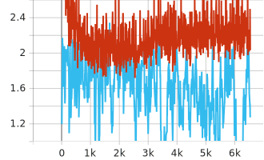
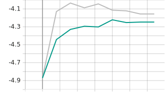
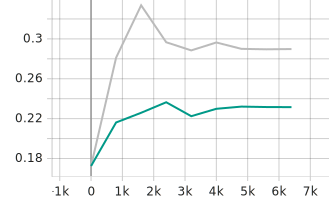

# Writeup on universal recommenders involving Microsoft News Dataset and others

## 1. Problem Formulation

The Microsoft News Dataset (MIND) dataset frames news recommendation as a learning-to-rank problem over user impression logs, where the objective is to predict click-through behavior given a user's browsing history and a set of candidate news articles. Each news article is represented by features including title, abstract, category, subcategory, and linked entities from knowledge graphs. 

The body of news articles aren't easily accessible anymore so they are not used for this attempt. This is appropriate considering development for the additional purpose of a universal recommender for truncated content on the web where not all features will be available. The sensitivity of recommendation quality with respect to feature availability can then also be studied.

For wider evaluation, I also curated a custom dataset mix from anonymised social media sites. The key challenge would be finding or replicating user impression logs through scraping.

(For brevity, only the most interesting files were included in this repository, all other boilerplate removed.)

## 2. Modelling Approaches

This writeup only covers supervised fine tuning on pre-trained text embedding models along with any additional layers. A general outline involves the following:
1) **News/User Encoding**:  Computing embeddings for titles/abstracts of history and candidate news. Encoded either separately or concatenated depending on architecture
2) **Scoring**: Pointwise scoring with Cosine similarity, or additional MLP layer
3) **Loss**: For training, compute loss based on scores/logits, then add any additional auxiliary components

### 2.1 Ranking Architectures
- **Bi-Encoder / Two-tower**: Encoding history items and candidate items independently -> Pool -> Cosine Similarity
- **Cross-Encoder**: Concatenating all history items and candidate item -> MLP
- **Half Cross-Encoder**: Concatenating only history items for cosine similarity with candidate item vector
- **Bi-Encoder + ColBERT**: Encoding each history item independently, then apply MaxSim operator, summing across all history token embeddings for max cosine score with each candidate token embedding
- **Half Cross-Encoder + ColBERT**: Encoding concatenated all history item tokens, then same MaxSim operator with candidate tokens

For this evaluation, any setup beyond bi-encoder only produced marginal gains with significant increase in latency.

### 2.2 Pooling
Token pooling follows from model's pre-training: Mean/CLS/Last.

Item pooling methods: Mean, TopK, TopK + Mean, SASRec Layer.

The mix of TopK + Mean as combination of scoring from these two pooling methods allow the model to capture domain-specific interest alongisde cross-domain taste. This is cheaper alternative compared to introducing multi-head attention layers or ensembling.

SASRec layer serves as additional transformer modules for deeper attention pooling across trainable item embeddings.

## 3. Loss Functions

### 3.1 Supervised Contrastive Learning
InfoNCE contrastive loss was observed to perform the best and thus used for majority of the experiments.

$$
L_{\text{INCE},\ i} = - \log \frac{\exp(sim(u_i, n_i^+) / \tau)}{\sum_{k \in K_i}\exp(sim(u_i, n_k) / \tau)}
$$

Where $i$ refers to indices of the impression sample, $n_i^+$ is the clicked/positive news item for sample $i$, $K_i$ is the candidate set which includes positive and negative items, with learnable/fixed temperature $\tau$. This listwise loss pulls user history embedding closer to positive news in latent space.

One variant with be the generalization to InfoNCE with arbitary number of positives (averaging the term across the positives):

$$
L_{\text{MINCE}^+,\ i} = - \frac{1}{|P_i|} \sum_{p \in P_i} \log \frac{\exp(sim(u_i, n_{p}^+) / \tau)}{\sum_{k \in K_i}\exp(sim(u_i, n_k) / \tau)}
$$

where $P_i$ is the positive sample set for impression sample $i$.

Given that we have direct negative labels for each impressions alongside class imbalance with an average 1 out of 10 candidates being positive, in-batch negative sampling was not used. Instead we roughly control per-row positive-negative ratio with hyperparameter e.g. 16, 32 total candidates per-row for training. Impressions have unevenly sized candidate sets so we sample within for positive and negative labels.

### 3.2 Alternative Loss Functions
In addition to InfoNCE-style contrastive loss, attempts were made with the following losses: 
- Margin ranking Loss (Pairwise)
$$L_{margin} = \sum_{i} \max(0, m - (sim(u_i, n_i^+) - sim(u_i, n_i^-)))$$
- RankNet Loss (Pairwise) where $\bar{P}_{i}$ is ground truth preference.
$$
P_{i} = \sigma(sim(u_i, n_i^+) - sim(u_i, n_i^-)) \\
L_{RankNet} = -\sum_{i} \bar{P}_{i} \log P_{i} + (1 - \bar{P}_{i}) \log(1 - P_{i})
$$

- Binary Cross-Entropy Loss (Pointwise)
$$
L_{BCE} = -\frac{1}{N}\sum_{i=1}^{N} [y_i \log(\hat{y}_i) + (1-y_i) \log(1-\hat{y}_i)]
$$

- Cosine Embedding Loss (Pairwise)
$$
L_{cosine} = \sum_i \begin{cases} 
1 - \cos(u_i, n_i^+) & \text{if } y = 1 \\
\max(0, \cos(u, n_i^-) - m) & \text{if } y = -1
\end{cases}
$$

### 3.3 Additional Loss Components
- Uniformity Loss: In addition to findings regarding anisotropy for BERT-like embedding models, the presence of mean-pooled component from range of cross-domain history items might increase likelihood of embeddings collapsing towards anisotropy. Contrastive loss already has aligning/repelling effect between history and candidate embeddings. For simplicity, uniformity scores are primarily added based on candidate embeddings only.
$$
L_{uni} = \log \left(\frac{1}{n^2} \sum_{i,j} e^{-2||z_i - z_j||^2}\right)
$$

- Redundancy Penalty: Taking inspiration from Maximal Marginal Relevance for deduplication in retrieval settings, this component uses the redundancy term. Highly similar items may produce high similarity scores but yet still possibly reflect as negative labels. Thus the motivation is to allow for duplicate aware training, that is when candidate item is a close repeat of history item. $U$ denotes the set of history item vectors, $\lambda_{redun}$ would be the similarity threshold that determines duplication.
$$
L_{redun} = max(0,  \max_{u_j \in U} sim(u_j, n_i) - \lambda_{redun})
$$

## 4. Ablation Study Results

Following the original MIND benchmark paper, we only compare experiments done involving only the `Title` feature, excluding others not limited to `Abstract`, `Body`, `Category`.

The primary model used here is `Alibaba-NLP/gte-modernbert-base`.

('-' indicates pending re-running of experiments with updates hyperparameters and subtle code changes)

| Configuration | MIND AUC | MIND MRR  | MIND NDCG@5 | Mix AUC | Mix MRR  | Mix NDCG@5 |
|--------------|----------|------------|----------|------------|----------|-|
| Bi-Encoder BCE | 0.6801 | 0.3250 | 0.3561 | - | - | - |
| Bi-Encoder INCE | 0.6758 | 0.3309 | 0.3634 | - | - | - |
| Bi-Encoder MINCE | **0.6818** | **0.3334** | **0.3671** | - | - | - |
| Bi-Encoder ID-SAS | 0.6647 | 0.3197 | 0.3509 | - | - | - |
| Cross-Encoder BCE | - | - | - | - | - | - |
| Bi-Encoder all components | - | - | - | - | - | - |

Table 1: Main architectures and losses on full MIND validation set (376K impressions). For ID-SAS where embedding models are frozen and instead allowing updates for item embeddings and SASRec layer, full fine-tuning on all 6 text features resulted in similar AUC (0.66349). Any improvements likely require modelling text embeddings for each feature separately.

| Configuration | MIND AUC | MIND MRR  | MIND NDCG@5 | Mix AUC | Mix MRR  | Mix NDCG@5 |
|--------------|----------|------------|----------|------------|----------|-|
| Base (NRMS) | 0.6622 | 0.3192 | 0.3453 | - | - | - |
| Half Cross-Encoder | - | - | - | - | - | - |
| Bi-Encoder - ColBERT | - | - | - | - | - | - |
| Half Cross-Encoder - ColBERT | - | - | - | - | - | - |

Table 2: Comparisons with ColBERT late interation, no additional components

For reference, the original MIND paper shows base results on the Test set with NRMS with AUC 0.6622, MRR 0.3192.

Also, the top of MIND leaderboard currently shows higher scores like AUC 0.7304, but as with the [2020 competition winner](https://msnews.github.io/competition.html), the body of news articles and other features are included in their training runs (most commonly attention pooling of each text feature before scoring MLP).

| Configuration | MIND AUC | MIND MRR  | MIND NDCG@5 | Mix AUC | Mix MRR  | Mix NDCG@5 |
|--------------|----------|------------|----------|------------|----------|-|
| Bi-encoder MINCE Loss | 0.6786 | 0.3309 | 0.3646 | - | - | - |
| + LoRA only | 0.6891 | 0.3372 | 0.3728 | - | - | - |
| + SASRec Pool | 0.6526 | 0.3041 | 0.3366 | - | - | - |
| + Mix pool (TopK + Mean) | 0.6836 | 0.3373 | 0.3721 | - | - | - |
| + Redundancy Penalty | 0.6855 | 0.3396 | 0.3740 | - | - | - |
| + All components | **0.6931** | **0.3462** | **0.3826** | - | - | - |

Table 3: Additions to Bi-Encoder on Mind Small Validation set (73K impressions). Larger batch sizes of 48 used. Learning rates lightly swept and set higher at 1e-4 to match LoRA's 5e-4. `All components` run involved using more performant `Mix` pooling over `SASRec`.

Interestingly low rank fine tuning often beats full fine-tuning.
Sweeps across ranks show performance peaking r=8 to r=16, with the rest degrading to full fine-tuning levels.

Experimenting with merits of LoRA: (WIP)
- X Forgetting less: Sweeps for freezing 50%-75% of layers for full-finetuning show moderately lower performance. Word embeddings are already frozen for all experiments. 
- X Implicit regulurization, perhaps in light of limited data
  - For now, Weight Decay sweep on full fine-tuning from 1e-3 to 1e-1 did not close performance gap

LoRA fine-tuning does show healthier gradient norms in the plot above (clipped at 2.0) perhaps discarding less potential corrective signal from dataset compared to full fine-tuning. A more interesting conclusion would be that informational taste is actually low-rank but that requires more thorough verification.

| Configuration | MIND AUC | MIND MRR  | MIND NDCG@5 | Mix AUC | Mix MRR  | Mix NDCG@5 |
|--------------|----------|------------|----------|------------|----------|-|
| Bi-encoder MINCE Loss | 0.6786 | 0.3309 | 0.3646 | - | - | - |
| <> Margin Ranking Loss | 0.6779 | 0.3272 | 0.3621 | - | - | - |
| <> RankNet Loss | 0.6774 | 0.3317 | 0.3649 | - | - | - |
| + Uniformity Auxiliary Loss (BS 8x6) | 0.6790 | 0.3331 | 0.3671 | - | - | - |

Table 4: Alternate losses for Bi-Encoder evaluated on Mind Small Validation set (73K impressions). BS=48, LR=1e-4. Uniformity Auxiliary Loss omitted from additions because it only showed marginal improvements with small batch sizes.

There are hints that rewarding uniformity wasn't necessary. Statistics relevant to anisotropy for candidates embeddings increased across training steps, and better performing models tend to have higher values as shown in the plots below e.g. mean cosine scores, cumulative variance of Principal Components, uniformity scores, which is opposite of the results obtained when adding uniformity loss term. (The grey lines indicate better performing model.)

Average candidate uniformity scores
 
Cumulative variance of candidate embeddings for top 5 PCs

| Configuration | MIND AUC | MIND MRR  | MIND NDCG@5 |
|--------------|----------|------------|----------|
| gte-small 30M | 0.6639 | 0.3213 | 0.3523 |
| gte-base 110M | 0.6687 | 0.3266 | 0.3582 |
| gte-large 330M | 0.6813 | 0.3313 | 0.3639 |

Table 5: Parameter scaling on MIND small validation set using `thenlper/gte-*` series.

## 5. Other Surveys

- Generative Recommenders
- Semantic IDs w/wo Finite Scalar Quantization
- Whitening

Note that we most only have positive samples for predicting clicks, whereas the deployment scenario could include negative samples that make up user history. Thus an alternative perspective of this architecture would be metric learning in the meta-learning domain, where we are doing binary classification given an arbitrary taste profile.

#### WIP

- [ ] Complete remaining experiments with standardised hyperparameters
- [ ] Add more analysis e.g. generalisability, domain/platform transferability, failure modes

